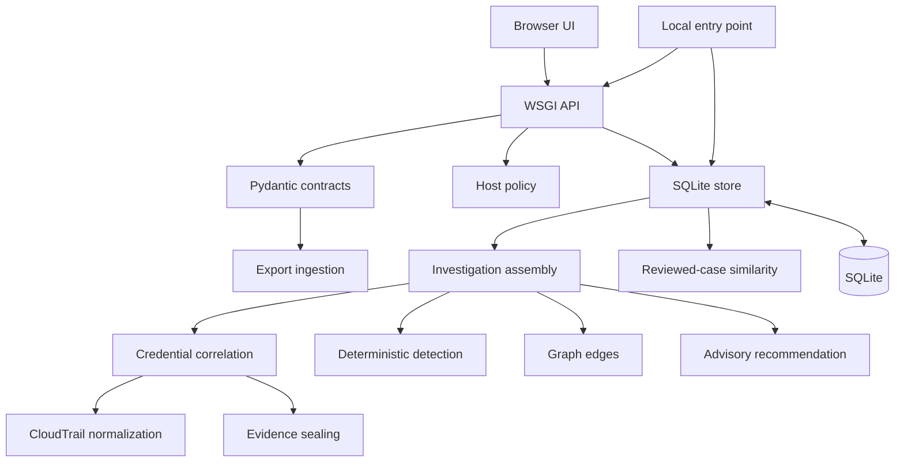

# Component diagram

Arrows show primary calls. See the [component design](../component-design.md) for shared dependencies.

```mermaid
flowchart TD
    Bootstrap["Local entry point"] --> API["WSGI API"]
    Bootstrap --> Store["SQLite store"]
    UI["Browser UI"] --> API
    API --> Host["Host policy"]
    API --> Models["Pydantic contracts"]
    Models --> Ingest["Export ingestion"]
    API --> Store
    Store --> Analysis["Investigation assembly"]
    Store --> Memory["Reviewed-case similarity"]
    Store <--> DB[("SQLite")]
    Analysis --> Correlation["Credential correlation"]
    Correlation --> Normalization["CloudTrail normalization"]
    Correlation --> Evidence["Evidence sealing"]
    Analysis --> Detection["Deterministic detection"]
    Analysis --> Graph["Graph edges"]
    Analysis --> Advice["Advisory recommendation"]
```
