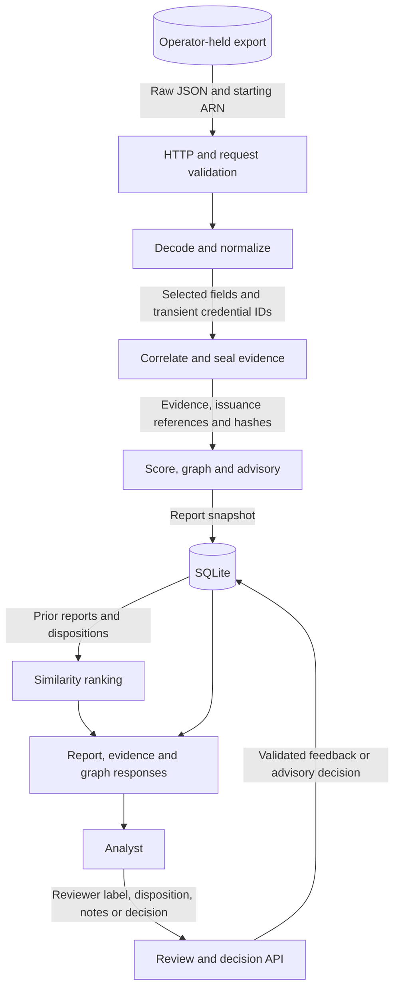

# Investigation data flow diagram

```mermaid
flowchart TD
    Export[("Operator-held export")] -->|"Raw JSON and starting ARN"| API["HTTP and request validation"]
    API --> Normalize["Decode and normalize"]
    Normalize -->|"Selected fields and transient credential IDs"| Correlate["Correlate and seal evidence"]
    Correlate -->|"Evidence, issuance references and hashes"| Report["Score, graph and advisory"]
    Report -->|"Report snapshot"| DB[("SQLite")]
    DB -->|"Prior reports and dispositions"| Similarity["Similarity ranking"]
    Similarity --> Read["Report, evidence and graph responses"]
    DB --> Read
    Read --> Analyst["Analyst"]
    Analyst -->|"Reviewer label, disposition, notes or decision"| Review["Review and decision API"]
    Review -->|"Validated feedback or advisory decision"| DB
```
