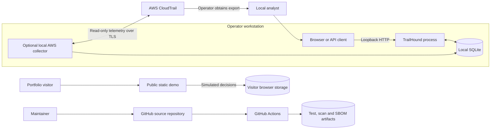

# System context diagram

```mermaid
flowchart LR
    AWS["AWS CloudTrail"] -->|"Operator obtains export"| Analyst["Local analyst"]
    Analyst --> Browser["Browser or API client"]
    subgraph Host["Operator workstation"]
        Browser -->|"Loopback HTTP"| App["TrailHound process"]
        App <--> DB[("Local SQLite")]
        Collector["Optional local AWS collector"] --> DB
    end
    Collector <-->|"Read-only telemetry over TLS"| AWS
    Visitor["Portfolio visitor"] --> Demo["Public static demo"]
    Demo -->|"Simulated decisions"| LocalStorage[("Visitor browser storage")]
    Maintainer["Maintainer"] --> Repo["GitHub source repository"]
    Repo --> CI["GitHub Actions"]
    CI --> Reports[("Test, scan and SBOM artifacts")]
```
